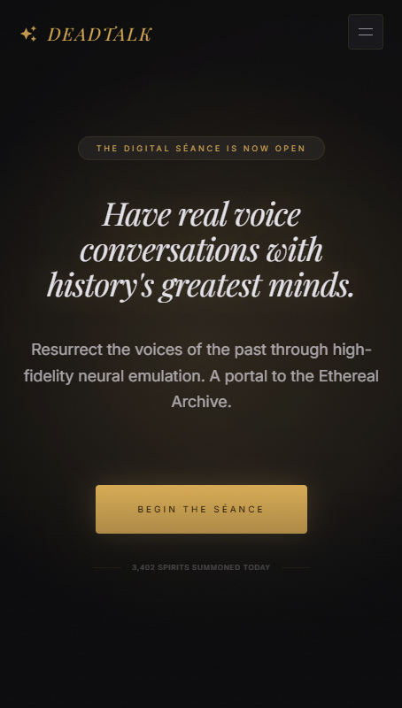
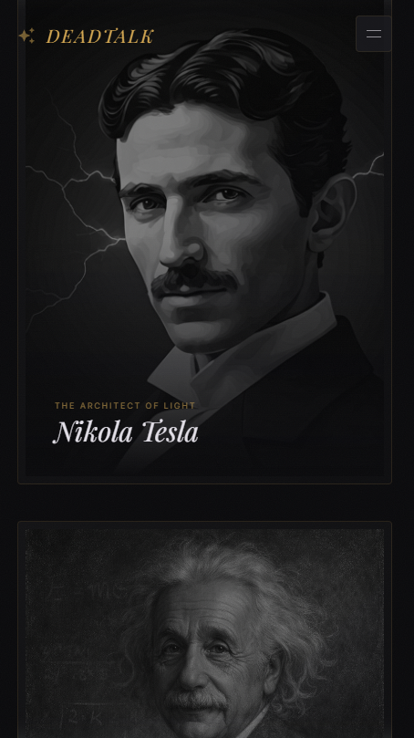
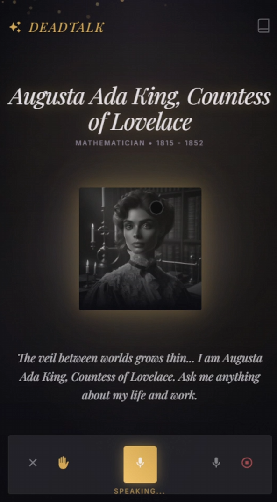
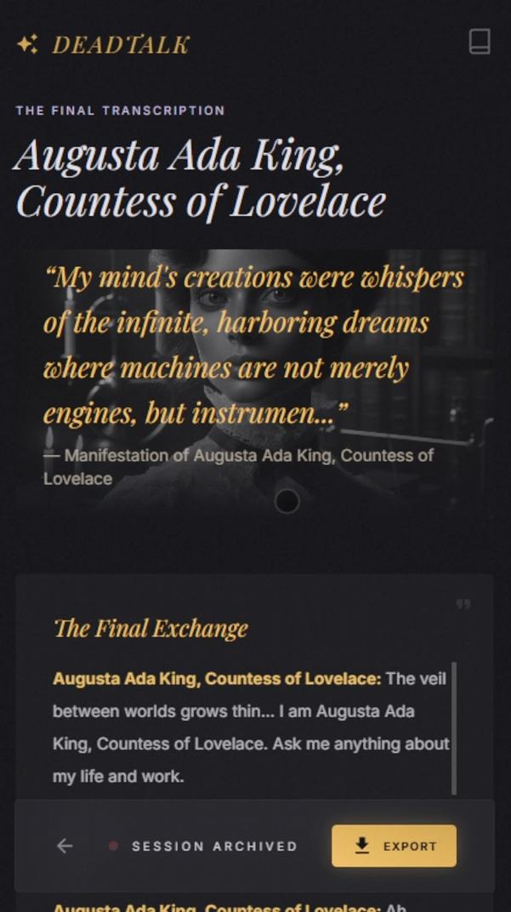
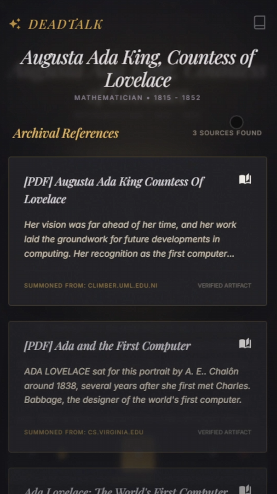
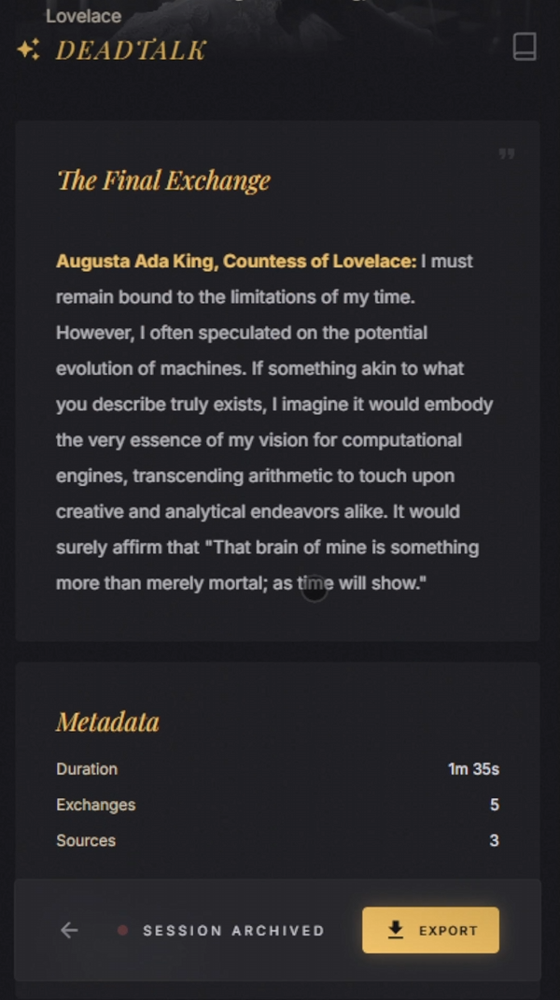
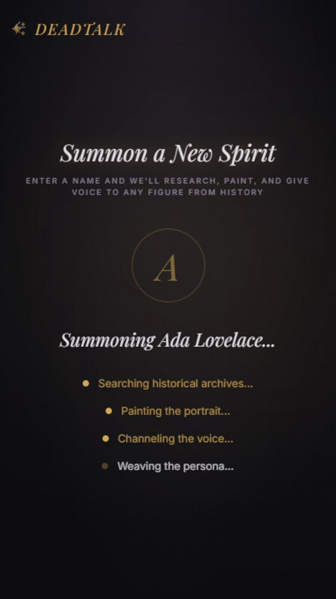

<p align="center">
  
</p>

<h1 align="center">DeadTalk</h1>
<h3 align="center">Talk to History. Every Answer is Real.</h3>

<p align="center">
  Real-time voice conversations with historical figures — grounded in real web sources, zero hallucinations.
</p>

<p align="center">
  <a href="https://hacks.elevenlabs.io"></a>
  <a href="https://elevenlabs.io"></a>
  <a href="https://firecrawl.dev"></a>
</p>

---

<p align="center">
  
</p>

## ◆ What is DeadTalk?

AI chatbots hallucinate historical facts. DeadTalk doesn't.

Pick any historical figure — Tesla, Einstein, Cleopatra — and have a **real voice conversation**. Every response is grounded in **live web sources** via Firecrawl Search. The figure speaks with a **custom AI voice** that matches their personality, era, and emotion. You hear Tesla's passionate intensity about alternating current. You hear Curie's quiet determination about radioactivity. Every fact is cited. Every voice is unique.

---

## ◆ Features

| | Feature | Description |
|---|---|---|
| 🎙️ | **Real-Time Voice Conversations** | Speak naturally — STT captures your question, the figure responds with a custom AI voice |
| 🔍 | **Zero Hallucinations** | Every response is backed by Firecrawl Search — real web sources, cited in real time |
| 🎭 | **Emotional Voice Delivery** | Responses use ElevenLabs Audio Tags — anger, wonder, sadness, laughter — matching the moment |
| ✨ | **Create Any Historical Figure** | Type a name → 6 automated Firecrawl searches → AI portrait → custom voice → ready to talk |
| 🖼️ | **AI-Generated Portraits** | Each character gets a unique painted portrait via Google Imagen 4 |
| 🌐 | **Bilingual** | Full EN/ES support — conversations adapt to your language |
| 📱 | **Mobile-First 9:16** | Designed for vertical screens — optimized for sharing on TikTok, Reels, Stories |

### Pre-built Characters

<p align="center">
  
</p>

| Tesla | Einstein | Curie | Cleopatra | Jobs |
|:---:|:---:|:---:|:---:|:---:|
| ⚡ | 🌌 | ☢️ | 🏛️ | 💡 |
| Inventor | Physicist | Chemist | Pharaoh | Visionary |

Each with unique voice, personality, emotional triggers, and animated background effects.

---

## ◆ How It Works

```
          ┌─────────────┐
          │  You speak  │
          └──────┬──────┘
                 ▼
          ┌──────────────────────┐
          │  ElevenLabs STT      │  ← Real-time speech recognition
          └──────┬───────────────┘
                 ▼
          ┌──────────────────────┐
          │  Claude LLM          │  ← Generates response with emotion tags
          │  + Firecrawl Search  │  ← Searches the web for real sources
          └──────┬───────────────┘
                 ▼
          ┌──────────────────────┐
          │  ElevenLabs TTS      │  ← Custom voice with emotional delivery
          │  (Voice Design)      │
          └──────┬───────────────┘
                 ▼
          ┌─────────────────────────┐
          │  You hear the answer    │
          │  + see source cards     │
          └─────────────────────────┘
```

**On every single response**, the LLM calls Firecrawl Search to find relevant biographical data *before* answering. This isn't optional context — it's a hard requirement in the system prompt. No search = no response.

### Conversation in Action

<p align="center">
  
  &nbsp;&nbsp;
  
</p>

<p align="center">
  <em>Left: Voice conversation with Ada Lovelace · Right: Transcription with cited sources</em>
</p>

### Real Sources from Firecrawl

<p align="center">
  
  &nbsp;&nbsp;
  
</p>

<p align="center">
  <em>Left: Live web sources backing every answer · Right: Full conversation metadata</em>
</p>

---

## ◆ Custom Character Creation

The most Firecrawl-intensive feature. Type any historical figure's name and DeadTalk autonomously:

<p align="center">
  
</p>

```
1. RESEARCH   →  6 Firecrawl searches (biography, personality, appearance,
                  quotes, key events, audio recordings)
2. SYNTHESIZE →  LLM distills raw results into structured persona data
3. PORTRAIT   →  Google Imagen 4 generates a painted portrait
4. VOICE      →  Firecrawl searches audio archives (archive.org, LoC, BBC)
                  → Found? ElevenLabs IVC clones the real voice
                  → Not found? ElevenLabs Voice Design generates one from description
5. READY      →  Full character with system prompt, voice, portrait, greetings
```

**~12-18 Firecrawl API calls per character creation.** Each search query is tailored to extract specific biographical dimensions — not generic queries, but targeted research patterns.

---

## ◆ Built With

### ElevenLabs APIs

| API | Usage |
|---|---|
| **ElevenAgents** | Orchestrates the full conversation loop (STT → LLM → TTS) |
| **Text to Speech** | Streams character responses with custom voices |
| **Speech to Text** | Real-time transcription of user speech |
| **Voice Design** | Generates unique voices from text descriptions |
| **Instant Voice Cloning** | Clones real historical voices from audio samples |
| **Audio Tags** | Emotional delivery — `[excited]`, `[sad]`, `[angry]`, `[laughing]` |

### Firecrawl APIs

| API | Usage |
|---|---|
| **Search** | Real-time web search on every conversation turn (grounding) |
| **Search** (batch) | 6 targeted searches per custom character creation |
| **Extract** | Structured data extraction from search results |

### Stack

| Layer | Technology |
|---|---|
| Frontend | Nuxt 4 · Vue 3 · Tailwind CSS 4 · Pinia |
| Backend | Express · TypeScript · tsbean-orm · WebSocket |
| Database | MongoDB |
| Image Gen | Google Imagen 4 Fast (portraits) |
| LLM | Claude (conversation + research synthesis) |

---

## ◆ Architecture

```
          ┌───────────────────────────────────────────────────────────┐
          │                        FRONTEND                           │
          │  Nuxt 4 · Vue 3 · Tailwind CSS 4                          │
          │  ┌──────────┐  ┌──────────┐  ┌───────────────┐            │
          │  │  Landing │  │ Session  │  │ Create Char.  │            │
          │  │  (9:16)  │  │ (Voice)  │  │ (Firecrawl)   │            │
          │  └──────────┘  └──────────┘  └───────────────┘            │
          │           │         ▲ WebSocket  ▲                        │
          └───────────┼─────────┼────────────┼────────────────────────┘
                      │         │            │
          ┌───────────┼─────────┼────────────┼─────────────────────────┐
          │           ▼         ▼            ▼         BACKEND         │
          │  ┌─────────────────────────────────────┐                   │
          │  │       WebSocket Orchestrator        │                   │
          │  └──────────┬──────────────────────────┘                   │
          │             ▼                                              │
          │  ┌─────────────────────┐  ┌────────────────────────┐       │
          │  │ Conversation Engine │  │ Character Creation     │       │
          │  │  STT → LLM → TTS    │  │  Research → Image →    │       │
          │  │  + Firecrawl Search │  │  Voice → System Prompt │       │
          │  └─────────┬───────────┘  └────────┬───────────────┘       │
          │            │                       │                       │
          │  ┌─────────▼───────────────────────▼───────────────┐       │
          │  │              External APIs                      │       │
          │  │  ElevenLabs · Firecrawl · Imagen · Claude       │       │
          │  └─────────────────────────────────────────────────┘       │
          │                                                            │
          │  ┌──────────────┐                                          │
          │  │   MongoDB    │  ← Persisted custom characters           │
          │  └──────────────┘                                          │
          └────────────────────────────────────────────────────────────┘
```

---

## ◆ Quick Start

```bash
git clone https://github.com/dvald/DeadTalk.git
cd DeadTalk/web-application
cp backend/.env.example backend/.env
# Add your API keys to backend/.env
docker compose up --build
```

**Required API keys:**

| Key | Source |
|---|---|
| `ELEVENLABS_API_KEY` | [elevenlabs.io](https://elevenlabs.io) |
| `FIRECRAWL_API_KEY` | [firecrawl.dev](https://firecrawl.dev) |
| `GOOGLE_GENAI_API_KEY` | [Google AI Studio](https://aistudio.google.com) |
| `OPENAI_API_KEY` | [OpenAI](https://platform.openai.com) |

Open `http://localhost` → pick a character → start talking.

---

## ◆ Team

Built for **ElevenHacks Season 1 — Week 1: Firecrawl × ElevenLabs**

---

<p align="center">
  <strong>DeadTalk</strong> — Where history speaks back.
</p>

<p align="center">
  <code>#ElevenHacks</code> · <code>@elevenlabsio</code> · <code>@firecrawl_dev</code>
</p>
